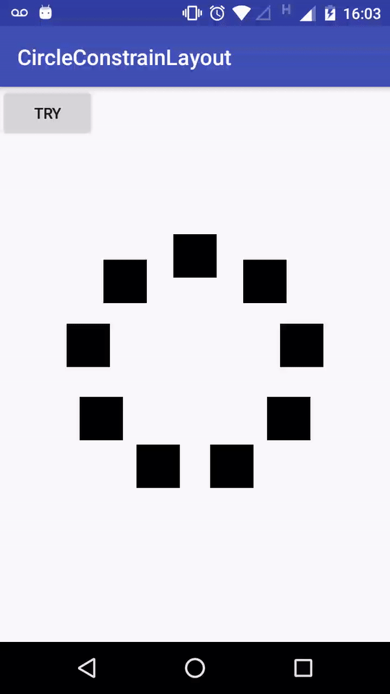

# CircularLayout

It`s a simple circular layout lib.



## How to use

1 - Import circularLayout module or .aar
    
    If you need help to import module this link (https://developer.android.com/studio/projects/add-app-module) help you.


2 - Add CircularLayout in layout xml

  ```xml
    <com.benhurqs.circularlayout.widget.CircularLayout
            android:id="@+id/circularLayout"
            android:layout_width="match_parent"
            android:layout_height="match_parent">
  
         <!-- Add your items here-->
         <ImageView
                  android:layout_width="40dp"
                  android:layout_height="40dp"
                  android:src="#000"/>

         <ImageView
                  android:layout_width="40dp"
                  android:layout_height="40dp"
                  android:src="#000"/>


    </com.benhurqs.circularlayout.widget.CircularLayout>
  ```


3 - Implementation code

    ```kotlin
          circularLayout
                .setAnimationType(AnimationType.ANTICLOCKWISE)
                .setCircleRadius(200)
                .setOnClickItemListener(this)
                .setOnAnimationListener(this)
                .setOnAnimationItemListener(this)
                .start()

    ```

Listeners

- CircularLayout.OnClickItemListener
- CircularLayout.OnAnimationListener
- CircularLayout.OnAnimationItemListener


---
About me

- [benhurqs.com](benhurqs.com)
- [https://www.linkedin.com/in/benhurqs/](https://www.linkedin.com/in/benhurqs/)


